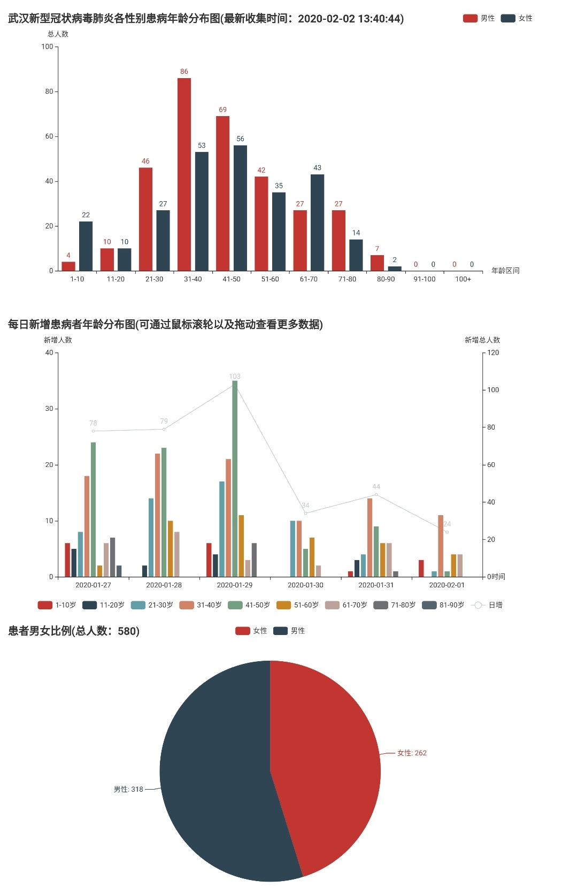

# 中国武汉新型冠状病毒肺炎不同性别感染者年龄分布

## 使用说明

目前是一个简单的武汉新型冠状病毒肺炎不同性别感染者年龄统计的Python脚本和一个使用pyecharts制作的柱状分布图。

本项目已经部署在 Github Pages 上了。可以直接访问 [这里](https://dipperss.github.io/)。每天更新一次。

## 数据来源

感谢[dragon-yuan](https://github.com/dragon-yuan/2019-nCoV-news)提供的API，减少了本项目获取数据的很大一部分工作量。
统计的数据来自于新闻报道，包括人民网、央视新闻、头条新闻。

## 注意事项
* 展示的数据均为确诊病例
* 数据统计的时间从2020-1-24起
* 用于统计方法存在一定缺陷，可能与实际情况有很大差别。

## 效果展示
